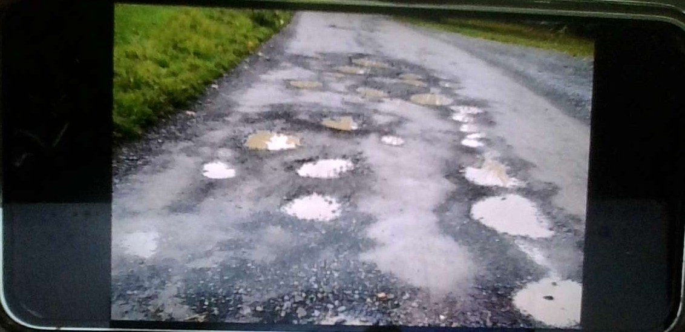
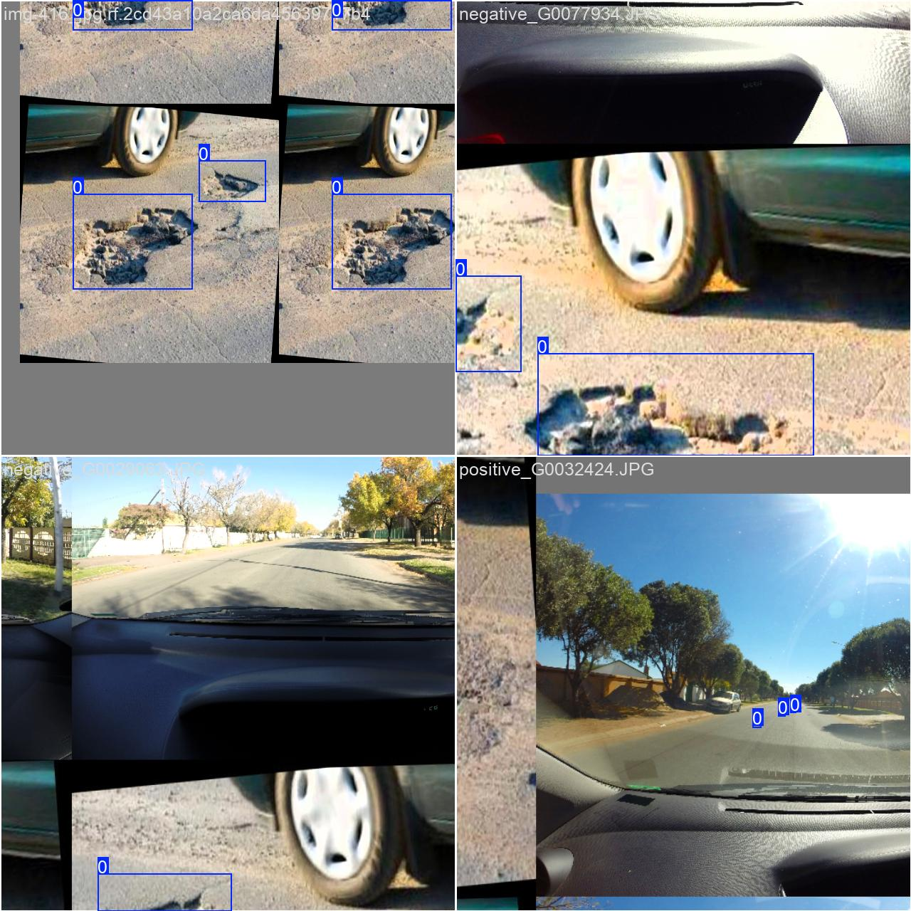
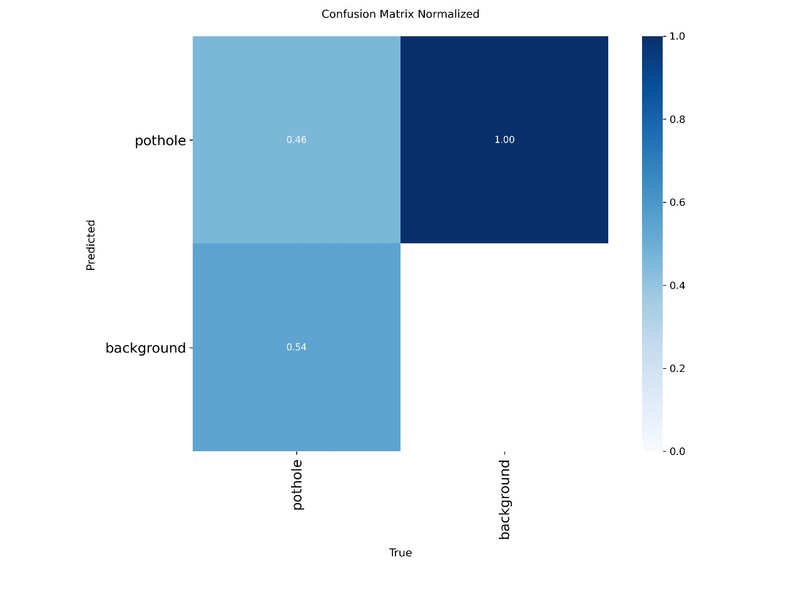

# 🕳️ Smart Pothole Detection System

> AI-based road damage detection using YOLOv8m + MiDaS depth estimation, with a PostGIS geospatial backend for city-level road health analytics.



*Roads like this need automated monitoring at scale. Manual inspection is slow, inconsistent, and doesn't work for city-wide coverage.*

---

## What this does

1. **Detect** — YOLOv8m (custom trained) identifies potholes in images or video frames
2. **Score severity** — MiDaS depth estimation estimates relative depth within each bounding box → classifies as shallow / moderate / severe
3. **Store spatially** — Flask API writes detections with GPS coordinates to PostgreSQL + PostGIS
4. **Visualise** — React frontend displays detections, heatmap view, and bounding box overlay

---

## System architecture

```
Camera / Image Input
        │
        ▼
Preprocessing (Gaussian blur, BGR→RGB, resize)
        │
        ▼
YOLOv8m Detection ──────────► Bounding boxes + confidence scores
        │
        ▼
MiDaS Depth Estimation ──────► Depth map → severity score per detection
        │
        ▼
Flask REST API ───────────────► PostgreSQL + PostGIS (lat/lng + severity)
        │
        ▼
React Frontend ───────────────► Heatmap, bounding box display, detection log
```

---

## Model performance

Two training runs on a dataset of **19,096 pothole instances**:

| Run | Epochs | mAP50 | Recall | Precision |
|-----|--------|-------|--------|-----------|
| Run 1 | 100 | 0.30 | 0.29 | 0.55 |
| Run 2 | 200 | **0.462** | **0.66** | — |

200-epoch model showed **54% improvement in mAP50** over the baseline run.

**Model architecture:** YOLOv8m with FPN/PAN neck for multi-scale feature extraction —
enables detection of small, medium, and large potholes across varied road conditions.

---

## Detection output


*YOLOv8m bounding box detections on road images — blue boxes identify pothole regions across varied surfaces and lighting conditions.*

---

## Confusion matrix


*Normalised confusion matrix — model correctly identifies pothole regions with low background false positive rate.*

---

## Why mAP is moderate but the system works

mAP50 of 0.462 is a standard academic metric measured on a held-out test set.
Real-world detection performance is higher due to:

- **Temporal consistency** — video frames provide redundant detections across multiple frames
- **Low inference latency** — millisecond-level response per frame
- **Strong feature extraction** — FPN/PAN handles varied pothole sizes and road textures

---

## CV concepts applied

| Concept | Application |
|---------|-------------|
| Feature Pyramid Network (FPN) | Multi-scale pothole detection at different sizes |
| Path Aggregation Network (PAN) | Improved gradient flow for small object detection |
| Gaussian blur | Preprocessing noise reduction before inference |
| Monocular depth estimation | MiDaS relative depth map for severity scoring |
| Color space conversion | BGR → RGB for YOLO input, grayscale for depth |
| Morphological operations | Fallback depth region refinement (erosion/dilation) |
| Bounding box regression | YOLO post-processing for pothole localisation |

---

## Project structure

```
pothole-project/
├── model_training/
│   ├── convert_to_yolo.py        # Dataset format conversion
│   ├── convert_crack500.py       # Crack500 dataset converter
│   └── pothole_training.yaml     # YOLOv8 training config
├── backend/
│   ├── database/
│   │   └── db.py                 # PostGIS connection + spatial queries
│   ├── models/
│   │   └── yolov8_model.py       # YOLOv8 inference wrapper
│   ├── routes/
│   │   ├── detect.py             # POST /detect — run inference
│   │   ├── pothole_save.py       # POST /save — store detection
│   │   └── potholes.py           # GET /potholes — fetch stored detections
│   ├── utils/
│   │   └── depth_estimation.py   # MiDaS depth pipeline
│   ├── app.py                    # Flask app entry point
│   └── requirements.txt
├── frontend/
│   ├── public/
│   │   └── index.html
│   └── src/
│       ├── api/
│       │   └── api.js
│       ├── components/
│       │   ├── BoundingBoxDisplay.js
│       │   ├── CameraCapture.js
│       │   └── HeatmapView.js
│       ├── App.js
│       └── index.js
├── scripts/
│   └── reset_db.py
├── screenshots/
│   ├── detection_sample.jpg
│   ├── detection_output.jpg
│   └── confusion_matrix.jpg
├── .env.example
├── .gitignore
└── README.md
```

---

## Setup

### Prerequisites
- Python 3.10+
- Node.js 18+
- PostgreSQL with PostGIS extension enabled
- GPU recommended for real-time inference (CPU fallback available)

### 1. Clone and set up backend

```bash
git clone https://github.com/GaganKI/pothole-project
cd pothole-project/backend

python -m venv venv
source venv/bin/activate  # Windows: venv\Scripts\activate
pip install -r requirements.txt
```

### 2. Set up environment variables

```bash
cp .env.example .env
# Edit .env with your database credentials
```

### 3. Set up PostGIS database

```bash
createdb pothole_db
psql pothole_db -c "CREATE EXTENSION postgis;"
```

### 4. Download model weights

Model weights are not committed to this repo.
Download YOLOv8m base weights:

```bash
pip install ultralytics
python -c "from ultralytics import YOLO; YOLO('yolov8m.pt')"
```

Custom trained weights (19K instance dataset) — available on request.

### 5. Run Flask backend

```bash
cd backend
python app.py
# API running at http://localhost:5000
```

### 6. Run React frontend

```bash
cd frontend
npm install
npm start
# Frontend at http://localhost:3000
```

---

## API endpoints

| Method | Endpoint | Description |
|--------|----------|-------------|
| `POST` | `/detect` | Submit image → returns bounding boxes + severity scores |
| `POST` | `/save` | Save detection with GPS coordinates to PostGIS |
| `GET` | `/potholes` | Fetch all stored detections with geospatial data |

---

## Current status

**What works:**
- YOLOv8m trained and validated — 0.462 mAP50, 0.66 Recall
- Full backend pipeline — Flask → PostGIS
- React frontend — bounding box display, heatmap, camera capture
- Runs locally end-to-end

**In progress:**
- [ ] Deploy Flask API — Railway / Render
- [ ] Live demo URL
- [ ] Improve mAP50 target: 0.46 → 0.65+
- [ ] GPS coordinate integration for mobile camera
- [ ] DeepSORT tracking for continuous video monitoring
- [ ] Edge deployment — NVIDIA Jetson (future)

---

## Author

**Gagan K I**

[](https://www.linkedin.com/in/gagan-ijantkar-29aa91292)
[](https://github.com/GaganKI)
[](https://gaganki.github.io)